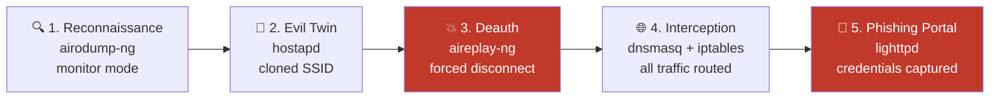

# Evil Twin Attack Defense Framework
### Practical Security Guidelines for Public Wi-Fi Users


> **Individual research project** — MAOU Gymnasium №16, Tyumen, Russia (2026)  
> Author: Saveliy Golubev | Supervisor: Yulia Myshko, Informatics Teacher

---

## Overview

This project presents a full research cycle on the **Evil Twin attack** — one of the most prevalent and underestimated threats in public Wi-Fi environments. The work combines rigorous theoretical analysis with hands-on simulation in an isolated laboratory, culminating in a practical set of defensive guidelines for everyday users.

**Core hypothesis:** A live, controlled demonstration of an Evil Twin attack produces more effective and internalized security guidelines than purely theoretical analysis.

---

## Problem Statement

Public Wi-Fi networks (cafes, airports, universities) have become standard infrastructure. Their primary advantage — open accessibility — is simultaneously their greatest security liability. Evil Twin attacks exploit this by:

- Mimicking legitimate access points with identical SSIDs
- Forcing victim devices to reconnect via deauthentication packets
- Capturing credentials through a phishing captive portal
- Performing Man-in-the-Middle interception of all unencrypted traffic

**The attack requires no advanced skills** — off-the-shelf tools automate every stage within minutes. This accessibility is precisely what makes it dangerous and worthy of public education.

---

## Research Scope

| Chapter | Focus |
|---|---|
| **1. Theoretical Analysis** | 802.11 architecture vulnerabilities, attack mechanics (5-stage model), comparison with other Wi-Fi attacks, legal & ethical framework |
| **2. Lab Simulation** | Isolated VirtualBox environment, airgeddon v11.22 framework, captive portal mechanics, WPA2 shared-key attack variant |
| **3. Defense Guidelines** | 6-rule protection framework, technical detection methods, VPN vs Tor vs hotspot comparison, vendor/ISP responsibilities |

---

## Technical Stack

### Attack Simulation Environment
- **Host OS:** Windows 10/11
- **Virtualization:** Oracle VM VirtualBox 7.0 (Internal Network mode — fully air-gapped)
- **Attack OS:** Kali Linux 2024.1 Rolling Release
- **Primary Framework:** airgeddon v11.22
- **Supporting Tools:** hostapd, dnsmasq, lighttpd, iptables, aireplay-ng, airodump-ng

### Network Isolation Architecture
```
[Physical Host — Windows]
        │
        └─ [VirtualBox Internal Network] ──► NO external connectivity
                │
                ├─ Kali Linux VM (attacker)
                └─ Android Device (victim — manual connection)
```

---

## Attack Chain



## Experiment Results

The full attack chain was reproduced in **~15 minutes** from VM launch to credential capture:

1. **Reconnaissance** — wireless interface placed in monitor mode, target SSID identified
2. **Evil Twin Deployment** — rogue AP created with matching SSID `Free_Public_Lab`, encryption disabled
3. **Deauthentication** — `aireplay-ng` deauth packets forced victim device to disconnect from legitimate AP
4. **Captive Portal Setup** — dnsmasq + lighttpd + iptables chain redirected all HTTP traffic to phishing login page
5. **Credential Capture** — test credentials (`test_user` / `Sup3rSecret!`) entered by victim, immediately displayed in attacker terminal

**Extended scenario:** Attack was also validated against a WPA2 network with a shared password (`PublicPassword123`), confirming that knowing the network password offers no protection against Evil Twin.

> All experiments were conducted exclusively on researcher-owned equipment in a physically and logically isolated environment, using test credentials only. No real user data was intercepted at any point.

---

## Key Findings

- **Technical barrier is low:** The entire attack is executable via a menu-driven script with basic CLI knowledge
- **HTTPS is insufficient:** Phishing portals can serve valid certificates (e.g., Let's Encrypt), making HTTPS checks alone unreliable
- **Auto-connect is the primary attack enabler:** Devices automatically joining strongest-signal known SSIDs are the critical vulnerability
- **Social engineering dominates:** The attack doesn't break cryptography — it bypasses it by exploiting user trust

---

## Practical Defense Guidelines (6-Rule Framework)

### Rule 1 — Use a VPN (Most Critical)
A trusted VPN encrypts all traffic before it leaves the device. Even on a compromised Evil Twin network, the attacker sees only an encrypted stream between the device and the VPN server.
- Choose providers with a **no-logs policy** and modern protocols (**WireGuard** or **OpenVPN**)
- Activate VPN **before** connecting to any public network

### Rule 2 — Control Wi-Fi Connections Manually
- **Disable auto-connect** to open networks on all devices
- **Delete saved networks** from hotels, cafes, transit hubs after use
- **Verify the exact SSID** with staff before connecting — beware of near-identical names (e.g., `Starbucks_Free` vs `Google Starbucks`)

### Rule 3 — Limit Activity on Public Networks
- Without an active VPN: avoid any authentication (email, banking, social media)
- For sensitive operations: use **mobile data (4G/5G)** — cellular networks provide built-in encryption between device and tower

### Rule 4 — Harden Your Accounts
- Enable **Two-Factor Authentication (2FA)** on all critical accounts — even captured credentials become useless without the OTP
- Use a **password manager** to maintain unique passwords per service, preventing credential stuffing

### Rule 5 — Apply Technical Verification
- Check for **duplicate SSIDs** using apps like Wi-Fi Analyzer — two networks with the same name but different signal strengths indicates a potential twin
- Compare **BSSID (MAC address)** of the connected AP against the known legitimate one
- Look for **DNS leak protection** in your VPN — a phishing page appearing despite an active VPN is a direct attack indicator

### Rule 6 — Keep Software Updated
- OS and browser updates patch vulnerabilities that can be exploited even within an Evil Twin session (e.g., browser-based code injection)

---

## Detection Methods (Advanced Users)

| Indicator | Method | Tool |
|---|---|---|
| Duplicate SSID | Scan for two APs with same name, different BSSID | Wi-Fi Analyzer (Android/iOS) |
| Signal anomaly | Suspiciously strong signal from a "known" network | Wi-Fi Analyzer |
| BSSID mismatch | Compare MAC against venue's posted AP info | Device Wi-Fi settings |
| DNS leak | VPN active but phishing page loads | DNS leak test sites |

---

## Comparative Analysis: Protection Methods

| Method | Effectiveness | Speed | Accessibility |
|---|---|---|---|
| **VPN (WireGuard/OpenVPN)** | ★★★★★ | ★★★★☆ | ★★★★☆ |
| **Personal hotspot (4G/5G)** | ★★★★★ | ★★★★★ | ★★★☆☆ |
| **Tor Browser** | ★★★★☆ | ★★☆☆☆ | ★★★☆☆ |
| **HTTPS only** | ★★☆☆☆ | ★★★★★ | ★★★★★ |
| **Auto-connect disabled** | ★★★☆☆ | ★★★★★ | ★★★★★ |

---

## Repository Structure

```
evil-twin-defense-framework/
│
├── README.md                        ← This file (project overview, EN)
├── docs/
│   └── executive-summary.md        ← 2-page summary for non-technical audience
├── guidelines/
│   └── security-rules.md           ← Standalone printable security checklist
└── diagrams/
    ├── attack-flow.md              ← 5-stage attack chain (Mermaid)
    ├── lab-architecture.md         ← Isolated VirtualBox lab setup (Mermaid)
    ├── defense-layers.md           ← 3-layer defense model (Mermaid)
    └── screenshots/                ← Lab experiment screenshots (from pres.pptx)
```

---

## Ethical & Legal Statement

All research was conducted in strict compliance with ethical hacking principles:

1. **Explicit ownership** — all equipment used belongs to the researcher
2. **Complete isolation** — VirtualBox Internal Network mode; zero interaction with external networks
3. **Educational purpose only** — no real user data captured, stored, or analyzed
4. **Test data exclusively** — all demonstrated credentials are synthetic

> Unauthorized deployment of Evil Twin attacks is a criminal offense under Russian Federation Criminal Code Articles 272 and 273. This project is designed to educate and defend, not to enable attacks.

---

## References

1. airgeddon framework — https://github.com/v1s1t0r1sh3r3/airgeddon
2. Kali Linux Documentation — https://www.kali.org/docs/
3. Roskachestvo — Evil Twin Glossary — https://rskrf.ru/glossary/zloy-dvoynik-evil-twin/
4. IEEE 802.11 Standard (Wireless LAN)
5. NIST SP 800-153 — Guidelines for Securing Wireless Local Area Networks
