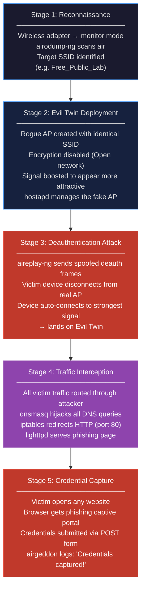

# Evil Twin Attack Chain — 5-Stage Flow

## Key Insight

> The attack does **not** break any cryptography.  
> It creates a new, trusted-looking network that the victim **chooses to join**.  
> The vulnerability is behavioral, not technical.
