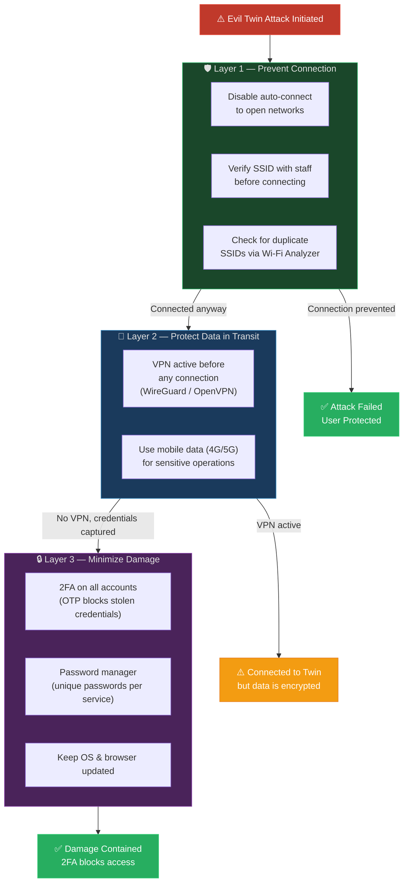

# Defense Framework — 3-Layer Model

```mermaid
flowchart TD
    THREAT["⚠️ Evil Twin Attack Initiated"]

    subgraph L1["🛡️ Layer 1 — Prevent Connection"]
        R2["Disable auto-connect\nto open networks"]
        R5["Verify SSID with staff\nbefore connecting"]
        R3A["Check for duplicate\nSSIDs via Wi-Fi Analyzer"]
    end

    subgraph L2["🔐 Layer 2 — Protect Data in Transit"]
        R1["VPN active before\nany connection\n(WireGuard / OpenVPN)"]
        R3["Use mobile data (4G/5G)\nfor sensitive operations"]
    end

    subgraph L3["🔒 Layer 3 — Minimize Damage"]
        R4["2FA on all accounts\n(OTP blocks stolen credentials)"]
        R4B["Password manager\n(unique passwords per service)"]
        R6["Keep OS & browser updated"]
    end

    OUTCOME_SAFE["✅ Attack Failed\nUser Protected"]
    OUTCOME_PARTIAL["⚠️ Connected to Twin\nbut data is encrypted"]
    OUTCOME_CAUGHT["✅ Damage Contained\n2FA blocks access"]

    THREAT --> L1
    L1 -->|"Connection prevented"| OUTCOME_SAFE
    L1 -->|"Connected anyway"| L2
    L2 -->|"VPN active"| OUTCOME_PARTIAL
    L2 -->|"No VPN, credentials captured"| L3
    L3 --> OUTCOME_CAUGHT

    style THREAT fill:#c0392b,color:#fff,stroke:#e74c3c
    style L1 fill:#1a472a,color:#e0e0e0,stroke:#27ae60
    style L2 fill:#1a3a5c,color:#e0e0e0,stroke:#2980b9
    style L3 fill:#4a235a,color:#e0e0e0,stroke:#8e44ad
    style OUTCOME_SAFE fill:#27ae60,color:#fff,stroke:#2ecc71
    style OUTCOME_PARTIAL fill:#f39c12,color:#fff,stroke:#e67e22
    style OUTCOME_CAUGHT fill:#27ae60,color:#fff,stroke:#2ecc71
```
