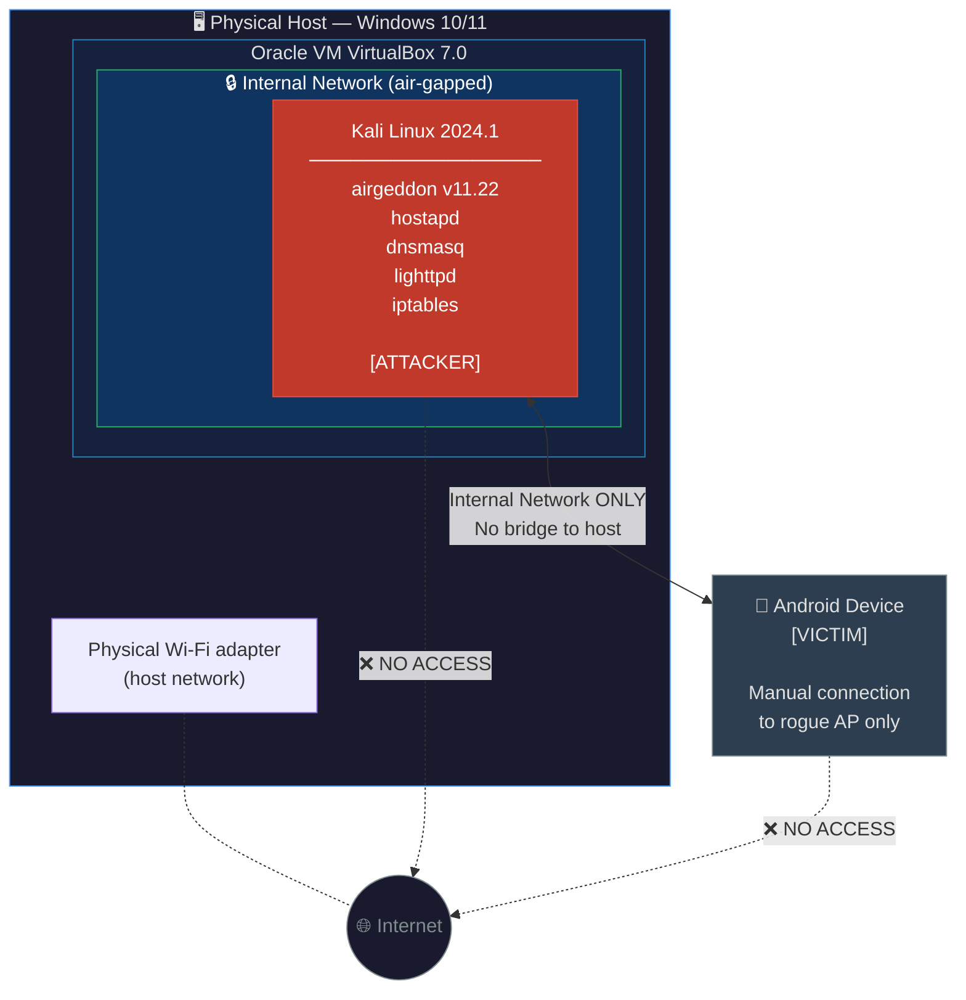

# Isolated Lab Architecture

## Why This Matters

| Property | Value |
|---|---|
| External network access | ❌ None — VirtualBox Internal Network mode |
| Real users affected | ❌ Zero — physically isolated environment |
| Legal status | ✅ Fully compliant — researcher-owned equipment only |
| Internet reachability | ❌ Blocked at hypervisor level |
